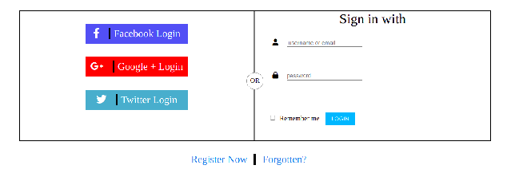

## Practice - Login Page
>
>This is a Login Page to Sign in.
>
>	
> ## How it works:
> There are 2 possibilities to Login.
>
> 1. On the left hand side, you can choose any one of the already existing accounts like Facebook, Google, or Twitter.
>
>2. The next option is: 
>
>- You can directly enter your **Email ID and Password** and click **LOGIN** button
>
> ## CSS properties used:
> - Parent Child selector
> - Group selector
> - flex
> - nth child selector
> - position- absolute & relative
